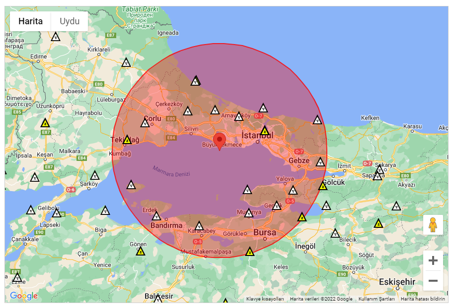

# Project Proposal Form

## Project Title : The Analysis of Eartquakes in Turkey Between 1910 - 2017
### Team Members: 
Mercan Uz 090190320   
Beyza Çelik 090190362

### Project Proposal

Especially when we are living in the Istanbul and waiting for a very big earthquake, this project can be really helpful for minimizing the loss of lives. Besides the expected big Istanbul earthquake, it can be used in life choices, investments and more. We can evaluate the probability of earthquake and shape our investments by the lowest loss risk. The risk of eartquakes is an important investment condition for invertors. Investors can safely invest to towns where the earthquake risk is low and it can be helpful for them to planning their capital in the long run.

In this project, our goal is aswering the following questions:
   * Can we estimate the magnitude, time and location of future earthquakes by using previous earthquake data ~~for each city of Turkey~~?
   * Can we say earthquakes are triggering each other (i.e. can an earthquake in ~~İzmir~~ Bursa trigger one in Istanbul).
   * Can we find a relation between the types and provinces of earthquakes in Turkey?
   * What are the most and least risky ~~cities~~ subprovinces according to earthquake risk by estimated probabilities?

In short, for accomplishing these goals, we will analyze the data according the type, location, magnitude etc. and we will search for any relation in the data. We will analyze and visualize when it is necessary, we are dealing with a kind of big data and it is not easy that analyzing so many rows by human eyes.

### Project Data:
We will use the following data in our project: [B.Ü. KRDAE Bölgesel Deprem-Tsunami İzleme ve Değerlendirme Merkezi](http://www.koeri.boun.edu.tr/sismo/2/deprem-verileri/sayisal-veriler/)

In this project, we will use the data from directly Boğaziçi University. 
 Our first claim about the data was;
* The data covers up all the recorded earthquakes in the latitudes between 35 - 42; longitudes 26 - 45. The database search time filter was set to dates 01/01/2017 to 30/12/2022. As there are too many earthquakes which have intensities smaller than 4.0, the filter of intensity was set to 3.5 to 9.0 (there was no earthquakes recorded larger than 9.0 intensity).

Then, we noticed after we get FTP key from Boğaziçi University, there are really big data, like hundereds of gigabytes. So, we made a decision about filtering our data. We will especillay look for Istanbul and the circle around the Istanbul with 50kms diameter because of the expecting big Istanbul earthquake.

### Machine Learning
We are planning to use following libraries; scikit, matplotlib, seaborn, numpy, pandas. Because of project has not done yet, we may add some libraries in the process. Our algorithm will be looking for the eartquakes in the 3 days of a random selected earthquakes happened, will compare depth and magnitutes will be look for a relationship between them such as logarithmic.

We will check our hypothesis in the process of project and then, we will be able to answer or verify our hypothesis, we will definitely mention this in the final form. For now, our hypothesis is earthquakes with short distance and big magnitudes can trigger the others, you can think this as aftershockes. More detailed, we are planning to explain the relationship between earthquakes and its aftershockes.

We will make predictions for the past and look for are they actually happened. Then, we will calculate the correctness of our algorithm and hypothesis.

### Task Distribution
Beyza Çelik, within the scope of the project, to create a graph showing the earthquake frequencies for each of the districts in the red region on the map above, and to classify earthquakes according to the Richter scale on this graph and to establish the relationship between them on a district basis as a result of this classification. Another topic is to find the most risky and least risky districts by not calculating the frequency of earthquakes that took place between 2017-2022 for the districts studied.

Mercan Uz will import the data from the source which we have mentioned above, clear and filter the data. Makes the maps according to coordinates of earthquakes for visualisation and displays them according to their magnitudes. Will analyze the previous earthquakes data and search for a mathematical (scientific) relationship between them for verifying that an earthquake triggers earthquakes. Decide about which probability method will be the best for this comparisons. Will make assumptions for earthquakes in the past and calculate the probability of correctness.

At the end, we will compare our results and decide about the verifying or declining the hypothesis.

-------------------------------------------------------------------------------------------------------------------------------

# Atabey's notes

## Round 1

I really like the dataset, but it is not the most recent one. Bogazici University has the most recent data on their [B.Ü. KRDAE Bölgesel Deprem-Tsunami İzleme ve Değerlendirme Merkezi](http://www.koeri.boun.edu.tr/sismo/2/deprem-verileri/sayisal-veriler/). Get the data from 2017 until now from there.

Also, even though I like the dataset and questions you asked the details on how you are going to answer those questions is not clear. You must state your hypothesis (past earthquakes give us clues on earthquakes in the near future) and questions (such as "Can we say earthquakes are triggering each other (i.e. can an earthquake in Izmir trigger one in Istanbul)?"), what type of machine learning algorithms are there to test your hyoptheses and answer your questions? How are they going to help you to answer the questions? Are the experiments you did verify your hypothesis? How? How are you going to know if the results of your experiments confirm and fail to confirm you hypothesis? I am going to see a detailed methodology section on these points.

Finally, I am going to need a detailed calendar: who is going to do what and when?

## Round 2

You haven't addressed the questions I raised earlier, or made any of the changes I asked.
